# 🎮 Isabela Ramos

I am a psychologist, with a postgraduate degree in education. Currently, I work as a customer success assistant at a company specializing in game design courses. My current role has inspired me to start my studies in Scrum, technology and programming. 

I have a deep appreciation for narratives in various forms, including books, music, and movies.

However, my primary hobby is gaming, which I adore! From digital games to tabletop RPG and board games. 

🎲📚🎵

### Connect with me

[//]: #()

### GitHub Stats

